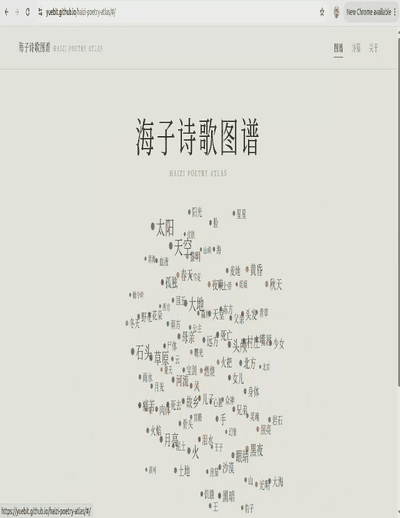

# 海子诗歌图谱 · Haizi Poetry Atlas

> **从一个词出发，重新进入海子的诗。**
> **From a word, back into the poem.**



**[探索海子诗歌图谱 →](https://yuebit.github.io/haizi-poetry-atlas/)**

**[关于海子 →](https://zh.wikipedia.org/zh-cn/%E6%B5%B7%E5%AD%90)**

**海子诗歌图谱（Haizi Poetry Atlas）** 是一个关于海子诗歌世界的数字人文项目。

它尝试把诗歌中的 **太阳、天空、大地、麦地、月亮、黑夜、村庄、河流、远方……** 重新放在一起，观察这些反复出现的意象如何彼此连接，又如何构成海子独特的诗歌世界。

这不是一个文学解释器，它更像一张地图。

数据只是入口，阅读最终仍然回到诗。

**[Explore the Atlas →](https://yuebit.github.io/haizi-poetry-atlas/)**

**[About Hai Zi →](https://en.wikipedia.org/wiki/Hai_Zi)**

**Haizi Poetry Atlas** is a digital humanities project exploring the recurring imagery and relationships in Hai Zi's poetry.

It brings together recurring images such as **the sun, sky, earth, wheat fields, moon, night, villages, rivers, and distant places**, and asks how these images connect to one another and together form the poetic world of Hai Zi.

This is not a machine for interpreting poetry. It is closer to a map.

Data is only the entrance. The journey should always lead back to the poems.


---

## 缘起 · Origin

2019 年夏天，我从茶卡盐湖开车向西，去了德令哈。

海子的《日记》写在那里。

那之后，我一直有一个很简单的好奇：

> **海子的诗里，到底反复出现着什么？**

最初，这个项目只是几十行 Python：从诗集中提取文本、分词、统计词频，再生成一张词云。

但“哪个词出现最多”并不是一个特别有意思的问题。

真正让我好奇的是：

> **海子的诗，看起来像什么？**

如果把那些不断回返的太阳、土地、黑夜、麦地、身体、故乡与死亡重新连接起来，它们会不会形成某种可以看见的结构？

于是有了 **海子诗歌图谱**。

In the summer of 2019, I drove west from Chaka Salt Lake to Delingha.

Hai Zi's poem *Diary* was written there.

Ever since that journey, I have carried a simple question with me:

> **What keeps returning in Hai Zi's poetry?**

The first version of this project was only a few dozen lines of Python: extract text from a poetry collection, tokenize it, calculate word frequencies, and generate a word cloud.

But knowing which word appears most often is not a particularly interesting question.

What I really wanted to know was:

> **What does Hai Zi's poetic world look like?**

If we reconnect the images that constantly return — the sun, the earth, the night, wheat fields, the body, home, death — can we begin to see a structure behind them?

That question became **Haizi Poetry Atlas**.

---

## 探索 · Explore

### ✦ 图谱 · Atlas

从整片意象星图进入海子的诗歌世界。

词的大小代表它在语料中的出现频率，意象之间的关系来自它们在诗篇中的共现。

点击任意一个词，可以继续进入它自己的世界。

Enter Hai Zi's poetic world through a constellation of recurring imagery.

The size of each word reflects its frequency in the corpus, while relationships between images are derived from how often they appear in the same poems.

Click any image to explore its own network, context, and history.

---

### ✦ 意象 · Imagery

选择一个意象，例如：

> **太阳 · Sun**

你可以看到：

* 它出现了多少次
* 出现在哪些诗篇中
* 与哪些意象经常共同出现
* 它在不同年份中的分布
* 它在诗中的具体上下文

从统计重新回到诗句。

For each recurring image, the atlas can show:

* total occurrences
* number of poems containing it
* related imagery
* distribution across time
* occurrences in poetic context

The purpose is always to move from statistics back into the poems themselves.

---

### ✦ 诗篇 · Poems

从意象进入诗篇，而不是把诗只当作数据。

搜索一个词，查看它出现在哪些作品中，并沿着上下文继续阅读。

整个项目始终遵循一个简单的方向：

> **data → poem**

而不是：

> **poem → dashboard**

The poetry explorer lets you move from an image back into the poems where it appears.

Search for a recurring motif, browse the works that contain it, and continue reading through its surrounding context.

The project follows one simple principle:

> **data → poem**

not:

> **poem → dashboard**

---

## 方法 · Method

分析方法刻意保持简单、透明。

The analytical methods are intentionally simple and transparent.

### 分词 · Tokenization

使用 `jieba` 进行中文分词，并加入人工整理的海子诗歌意象词表，以保证某些关键表达能够作为完整概念被识别。

Chinese tokenization is performed with `jieba`, supplemented by a manually curated lexicon of recurring imagery so that important poetic concepts remain intact.

例如 / For example:

```text
麦地
黎明
黑夜
德令哈
```

---

### 频率 · Frequency

对于每个意象，统计：

For each image or motif, the pipeline calculates:

```text
frequency    → 在整个语料中的出现次数
               total number of occurrences in the corpus

poem_count   → 包含该意象的诗篇数量
               number of poems containing the image
```

---

### 意象关系 · Imagery Relationships

两个意象之间的关系目前采用**诗篇级共现**计算。

Relationships between images are currently calculated using **poem-level co-occurrence**.

对于意象 `A` 和 `B`：

For imagery terms `A` and `B`:

```text
score(A, B)

= 同时包含 A 与 B 的诗篇数
  ─────────────────────────────
  √(包含 A 的诗篇数 × 包含 B 的诗篇数)
```

In English:

```text
score(A, B)

= poems containing both A and B
  ─────────────────────────────
  √(poems containing A × poems containing B)
```

它本质上是两个二值诗篇出现向量的余弦相似度，结果位于 `0–1` 之间。

Essentially, this is cosine similarity between two binary poem-occurrence vectors, producing a score between `0` and `1`.

这个数字只回答：

> **这两个意象是否经常出现在同一首诗里？**

它不试图回答：

> **它们在文学上意味着什么？**

This score answers only one question:

> **Do these two images often appear in the same poems?**

It does not attempt to answer:

> **What do they mean together?**

**这个数字并不假装理解诗。**

**The number does not pretend to understand poetry.**

---

### 时间 · Time

如果能够可靠识别诗篇写作年份，则按照年份统计意象的出现情况。

无法确定的年份保持为空。

不作猜测。

When a poem's writing year can be reliably identified, imagery is also aggregated over time.

Unknown dates remain unknown.

No dates are invented or guessed.

---

## 架构 · Architecture

整个项目保持尽可能轻量：

The project intentionally keeps the architecture lightweight:

```text
local poetry corpus
        ↓
Python analysis pipeline
        ↓
derived JSON data
        ↓
static web experience
```

没有数据库。

没有运行时后端。

语料分析在本地完成一次，随后生成静态 JSON，由前端直接加载。

There is no database and no runtime backend.

The corpus is processed locally, producing static derived JSON files that are loaded directly by the web frontend.

```text
haizi-poetry-atlas/
│
├── corpus/
│   └── README.md
│
├── pipeline/
│   ├── extract.py
│   ├── clean.py
│   ├── tokenize.py
│   ├── lexicon.py
│   ├── segmentation.py
│   ├── imagery.py
│   ├── cooccurrence.py
│   ├── timeline.py
│   ├── export.py
│   └── run.py
│
├── data/
│   ├── stats.json
│   ├── imagery.json
│   ├── cooccurrence.json
│   └── poems.json
│
├── web/
│   └── React + Vite + TypeScript + D3
│
└── requirements.txt
```

分析与展示彼此分离：

**Python 负责理解数据的结构，Web 负责让人探索它。**

Analysis and presentation remain separate:

**Python structures the data.
The web experience makes it explorable.**

---

## 本地运行 · Local Development

### Requirements

* Python 3.9+
* Node.js 18+

### 1. 准备语料 · Prepare the corpus

按照：

Follow the instructions in:

```text
corpus/README.md
```

准备本地诗歌语料。

to prepare a local poetry corpus.

---

### 2. 运行分析管线 · Run the analysis pipeline

```bash
python3 -m venv .venv

.venv/bin/pip install -r requirements.txt

.venv/bin/python -m pipeline.run
```

分析结果会生成到：

Generated analysis data will be written to:

```text
data/
```

---

### 3. 启动网站 · Start the web app

```bash
cd web

npm install

npm run dev
```

生产构建：

Production build:

```bash
npm run build
```

输出位于：

Output:

```text
web/dist/
```

---

## 语料 · Corpus

这个仓库**不分发海子诗歌全文或原始 PDF**。

公开的是：

* 分析代码
* 意象词典
* 统计数据
* 共现关系
* 元数据
* 用于界面展示的有限上下文

完整语料需要由使用者自行准备。

This repository **does not distribute the complete text of Hai Zi's poetry or the original PDF corpus**.

The public repository contains:

* analysis code
* imagery lexicon
* derived statistics
* co-occurrence relationships
* metadata
* limited contextual excerpts where appropriate

Users must provide the complete corpus locally.

项目因此保持这样的结构：

The resulting structure is:

```text
private corpus
      ↓
open analysis
      ↓
derived public data
```

---

## 局限 · Limitations

这不是一项严格意义上的文学研究，也不是一个能够“理解海子”的 AI 系统。

目前仍存在许多限制：

* PDF 文本提取可能产生格式噪声
* 诗篇边界识别并不总是准确
* 部分标题与写作年份无法可靠恢复
* 长诗的结构切分尤其复杂
* 人工意象词表不可避免地带有选择性
* 共现只能表示统计上的邻近，不能替代文学分析

This is neither a definitive literary study nor an AI system that claims to “understand” Hai Zi.

Current limitations include:

* PDF extraction may introduce formatting noise
* poem boundary detection is not always reliable
* some titles and writing dates cannot be confidently recovered
* long poems are especially difficult to segment
* the imagery lexicon inevitably reflects editorial choices
* statistical co-occurrence cannot replace literary interpretation

因此，这张图谱应该被理解为：

> **一种阅读入口，而不是阅读结论。**

The atlas should therefore be understood as:

> **an entrance into reading, not a conclusion about the poems.**

---

## 路线图 · Roadmap

### 地理 · Places

把诗歌中的地理重新放回地图：

Bring geographical references in the poems back onto a map:

```text
德令哈 · Delingha
青海 · Qinghai
北京 · Beijing
昌平 · Changping
黄河 · Yellow River
长江 · Yangtze River
…
```

让诗歌与真实世界重新发生联系。

Reconnect the poetic world with the physical one.

---

### 语义探索 · Semantic Exploration

未来也许会加入 embedding，让搜索不再局限于具体词汇。

Semantic embeddings may eventually allow exploration beyond literal keyword matching.

例如搜索：

For example:

```text
离开故乡
leaving home
```

或者：

or:

```text
夜晚、孤独、远方
night, solitude, distance
```

然后寻找语义上接近的诗篇。

and discover poems that are semantically close to those ideas.

AI 不会成为这个项目的主角。

**诗才是。**

AI will not become the protagonist of this project.

**The poetry will.**

---

**Poetry × Computation × Wandering**
